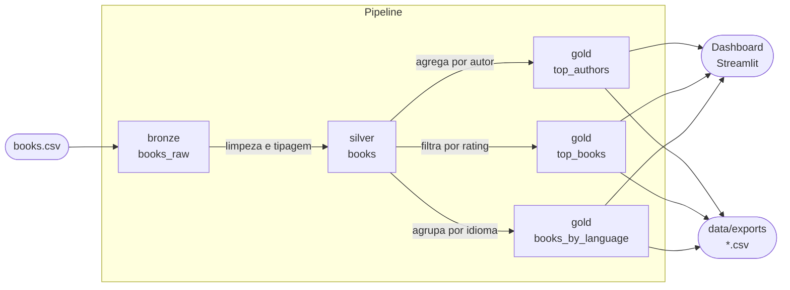

# goodreads-data-platform

[](https://github.com/Iana-Neri22/goodreads-data-platform/actions/workflows/ci.yml)


Pipeline de dados em camadas (bronze → silver → gold) para análise do dataset de livros do Goodreads, usando DuckDB como warehouse local.

## Arquitetura



## Estrutura

```
goodreads-data-platform/
├── .github/
│   └── workflows/
│       └── ci.yml             # Pipeline de CI (lint, format, type-check, testes)
├── dashboard/
│   └── app.py                 # Dashboard Streamlit (autores, livros, idiomas)
├── data/
│   ├── books.csv              # Dataset fonte
│   └── exports/               # CSVs exportados (gerados, não versionados)
├── ingestion/
│   ├── bronze.py              # Ingestão bruta do CSV
│   ├── silver.py              # Limpeza e tipagem dos dados
│   ├── checks.py              # Verificações de qualidade
│   ├── gold.py                # Agregações analíticas
│   └── py.typed               # Marcador PEP 561
├── logs/
│   └── pipeline.log           # Histórico de execuções (gerado, não versionado)
├── tests/
│   └── test_pipeline.py       # Testes automatizados
├── scripts/
│   └── prefect_start.ps1      # Inicialização completa do Prefect (servidor + worker)
├── .pre-commit-config.yaml    # Hooks de pre-commit (ruff, mypy)
├── .python-version            # Versão do Python (3.11)
├── flow.py                    # Flow e tasks Prefect
├── Makefile                   # Atalhos de comandos
├── pipeline.py                # Orquestrador CLI do pipeline
├── prefect.yaml               # Deployments Prefect
├── pyproject.toml             # Configuração de ferramentas
├── requirements.txt           # Dependências
├── serve.py                   # Servidor local Prefect (modo desenvolvimento)
└── warehouse.duckdb           # Banco local (gerado, não versionado)
```

## Camadas

| Camada | Tabela | Descrição |
|---|---|---|
| Bronze | `bronze.books_raw` | Dados brutos do CSV, todos como VARCHAR |
| Silver | `silver.books` | Dados limpos com tipos corretos, linhas inválidas removidas |
| Gold | `gold.top_authors` | Autores agregados por total de avaliações |
| Gold | `gold.top_books` | Livros mais bem avaliados (mín. 1.000 avaliações) |
| Gold | `gold.books_by_language` | Distribuição de livros por idioma |

## Instalação

```bash
make install
```

Ou manualmente:

```bash
python -m venv .venv
.venv\Scripts\activate      # Windows
pip install -r requirements.txt
pre-commit install
```

## Configuração

Copie o arquivo de exemplo e ajuste os valores conforme necessário:

```powershell
Copy-Item .env.example .env
```

Todas as variáveis são opcionais — sem `.env`, o pipeline usa os valores padrão. Consulte [.env.example](.env.example) para a lista completa.

## Uso

Executar o pipeline completo:

```bash
python pipeline.py
```

Executar etapas específicas:

```bash
python pipeline.py --steps bronze,silver
```

Usar um CSV diferente do padrão:

```bash
python pipeline.py --input caminho/para/outro.csv
```

Usar um banco DuckDB diferente do padrão:

```bash
python pipeline.py --db outro_warehouse.duckdb
```

Controlar o nível de logging:

```bash
python pipeline.py --log-level WARNING   # silencioso
python pipeline.py --log-level DEBUG     # verboso
```

Os argumentos podem ser combinados:

```bash
python pipeline.py --input outro.csv --db dev.duckdb --steps bronze,silver --log-level WARNING
```

## Dashboard

Instalar as dependências do dashboard:

```bash
pip install -e ".[dashboard]"
```

Iniciar o dashboard (requer o warehouse gerado pelo pipeline):

```bash
make dashboard
```

O dashboard abre em `http://localhost:8501` com três abas: **Autores**, **Livros** e **Idiomas**.

## Orquestração com Prefect

O pipeline pode ser orquestrado com [Prefect](https://docs.prefect.io), que adiciona UI de monitoramento, histórico de execuções e agendamento.

Instalar as dependências do Prefect:

```bash
pip install -e ".[prefect]"
```

### Modo simples — `serve.py`

Sobe um servidor embutido sem infraestrutura adicional. Ideal para desenvolvimento local.

```bash
# Terminal 1 — inicia o servidor e aguarda runs
python serve.py

# Terminal 2 — dispara um run
prefect deployment run 'goodreads-pipeline/local'
```

### Modo completo — servidor + worker

Necessário para usar a UI, agendamentos e múltiplos workers.

```bash
make prefect      # abre servidor e worker em janelas separadas, registra deployments
make prefect-run  # dispara o pipeline completo
```

A UI fica disponível em `http://localhost:4200` após `make prefect`.

### Deployments disponíveis

| Deployment | Etapas | Comando |
|---|---|---|
| `full-pipeline` | bronze → silver → checks → gold | `make prefect-run` |
| `ingest-only` | bronze → silver | `prefect deployment run 'goodreads-pipeline/ingest-only'` |

### Agendamento

Para executar o pipeline automaticamente, adicione um `schedule` no [prefect.yaml](prefect.yaml) sob o deployment desejado e rode `make prefect` novamente:

```yaml
schedules:
  - cron: "0 6 * * *"
    timezone: "America/Sao_Paulo"
    active: true
```

## Exportações

Os resultados são exportados automaticamente para `data/exports/`:
- `top_authors.csv`
- `top_books.csv`
- `books_by_language.csv`

Os logs ficam em `logs/pipeline.log` com rotação automática (máx. 1 MB, 5 arquivos).

## Qualidade de código

Atalhos via `make`:

```bash
make install     # cria venv, instala dependências e configura pre-commit
make check       # lint + formato + type-check + testes (equivalente ao CI)
make test        # pytest com cobertura (mínimo 100%)
make lint        # ruff check .
make format      # ruff format .
make format-check  # ruff format --check . (usado pelo make check)
make type-check  # mypy ingestion pipeline.py
make run         # python pipeline.py
make dashboard   # streamlit run dashboard/app.py
make prefect     # sobe servidor Prefect + worker + registra deployments
make prefect-run # dispara o deployment full-pipeline
make clean       # remove warehouse.duckdb, logs/ e data/exports/
```

Ou diretamente:

```bash
pytest
ruff check .
ruff format .
mypy ingestion pipeline.py
```

Lint, formato e type check são executados automaticamente no CI a cada push.
